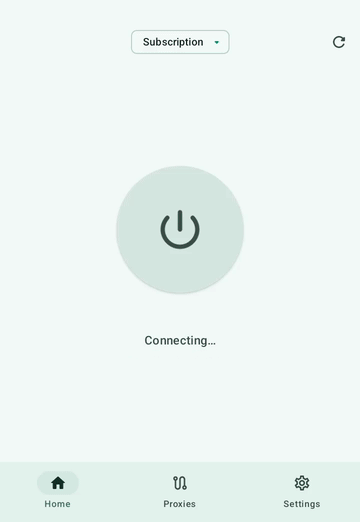
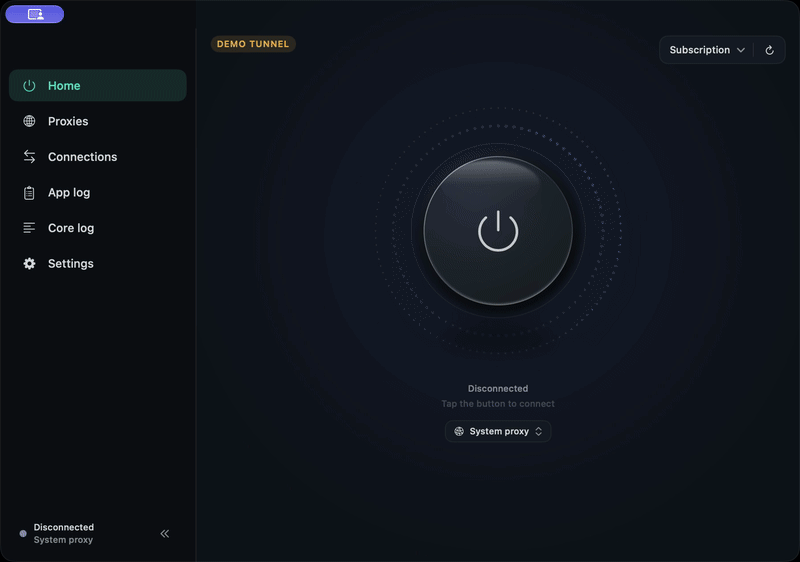
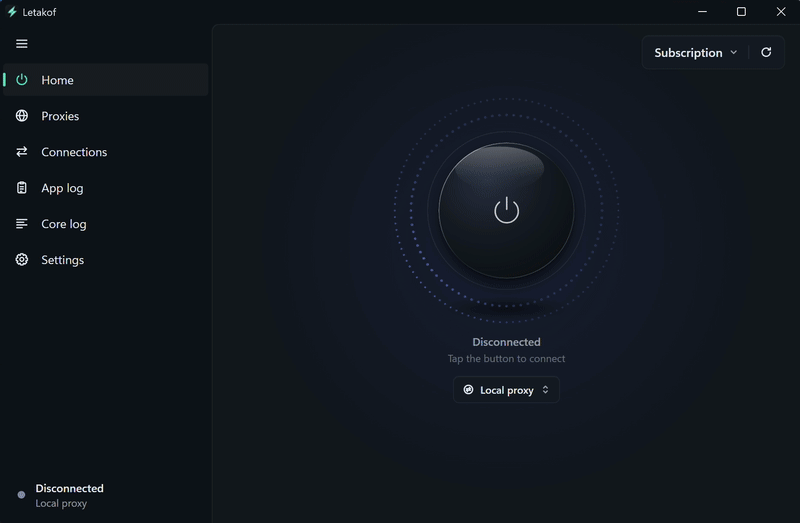

  

<h1 align="center">Letakof</h1>

VPN and proxy client powered by <strong>Mihomo</strong>.

Preliminary version for Android, macOS and Windows.

<strong>English</strong> · <a href="README.ru.md">Русский</a>

  <a href="https://github.com/dorian6996/Letakof/releases">Releases</a> ·
  <a href="https://github.com/dorian6996/Letakof/issues/new">Report a bug</a>

## Features

- Clash/Mihomo YAML subscriptions, profile updates and HWID support. Traffic allowance, expiration date and provider announcements.
- Proxy groups with latency testing, automatic server selection, fallback and load balancing.
- TUN, system proxy and local HTTP/SOCKS5 proxy modes. Password-protected proxy access for devices on the local network.
- Connection scenarios that select the operating mode based on the network type.
- Whitelist mode, when enabled by the provider.
- Custom rules for domains, IP addresses, subnets and ports, preserved when a subscription updates.
- System DNS, DNS over HTTPS or DNS from the profile; IPv6 settings and GEO database updates.
- Connection inspection with matched rules, proxy chains and core logs.

## Protocols

Mihomo supports VLESS, VMess, Trojan, Shadowsocks, Hysteria, Hysteria2, TUIC, WireGuard, AnyTLS, SOCKS5 and HTTP, among other protocols. Available servers and their transport settings depend on the subscription.

Subscriptions use the Clash/Mihomo YAML format.

## Demo

Connecting and opening proxy groups. Subscription, servers and traffic are simulated.

<table>
  <tr><th>Android</th><th>macOS</th><th>Windows</th></tr>
  <tr>
    <td valign="top" align="center"></td>
    <td valign="top" align="center"></td>
    <td valign="top" align="center"></td>
  </tr>
</table>

## Releases and bug reports

Builds and version notes are published in [Releases](https://github.com/dorian6996/Letakof/releases).

Submit bug reports and feature requests in [Issues](https://github.com/dorian6996/Letakof/issues). Include the app version, OS version and steps to reproduce the issue.

Letakof is proprietary software. This repository is used for releases and bug reports and contains only documentation and repository assets. Application source code is not published here.

