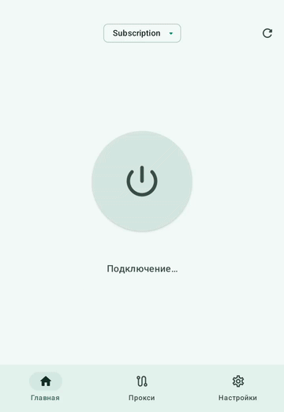
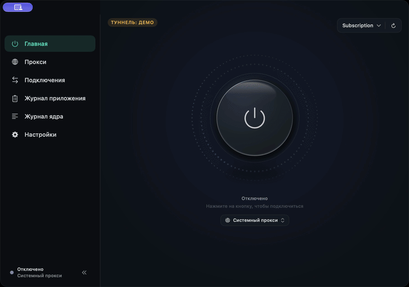
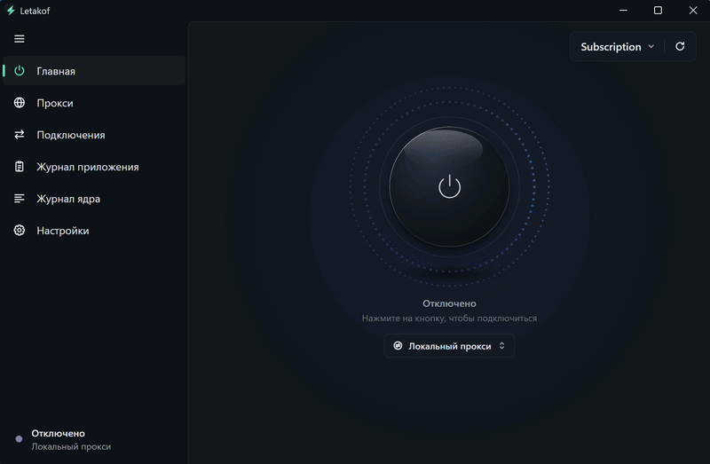

  

<h1 align="center">Letakof</h1>

VPN- и прокси-клиент на ядре <strong>Mihomo</strong>.

Предварительная версия для Android, macOS и Windows.

<a href="README.md">English</a> · <strong>Русский</strong>

  <a href="https://github.com/dorian6996/Letakof/releases">Релизы</a> ·
  <a href="https://github.com/dorian6996/Letakof/issues/new">Сообщить об ошибке</a>

## Возможности

- Подписки Clash/Mihomo YAML, обновление профилей и поддержка HWID. Лимит трафика, срок действия и объявления провайдера.
- Группы прокси с проверкой задержки, автоматическим выбором сервера, резервированием и балансировкой нагрузки.
- TUN, системный прокси и локальный HTTP/SOCKS5-прокси. Доступ к прокси для устройств локальной сети по паролю.
- Сценарии подключения с выбором режима работы в зависимости от типа сети.
- Режим белых списков, если он включён провайдером.
- Свои правила для доменов, IP-адресов, подсетей и портов, которые сохраняются при обновлении подписки.
- Системный DNS, DNS поверх HTTPS или DNS из профиля; настройки IPv6 и обновление баз GEO.
- Просмотр соединений со сработавшими правилами, цепочками прокси и журналом ядра.

## Протоколы

Ядро Mihomo поддерживает VLESS, VMess, Trojan, Shadowsocks, Hysteria, Hysteria2, TUIC, WireGuard, AnyTLS, SOCKS5, HTTP и другие протоколы. Доступные серверы и параметры транспорта зависят от подписки.

Подписки используются в формате Clash/Mihomo YAML.

## Демонстрация

Подключение и раскрытие групп прокси. Подписка, серверы и трафик — демонстрационные.

<table>
  <tr><th>Android</th><th>macOS</th><th>Windows</th></tr>
  <tr>
    <td valign="top" align="center"></td>
    <td valign="top" align="center"></td>
    <td valign="top" align="center"></td>
  </tr>
</table>

## Релизы и баг-репорты

Сборки и описания изменений публикуются в разделе [Releases](https://github.com/dorian6996/Letakof/releases).

Баг-репорты и предложения отправляйте в [Issues](https://github.com/dorian6996/Letakof/issues). Укажите версию приложения, версию ОС и шаги воспроизведения ошибки.

Letakof — проприетарное программное обеспечение. Репозиторий предназначен для релизов и баг-репортов и содержит только описание и ассеты репозитория. Исходный код приложения здесь не публикуется.

